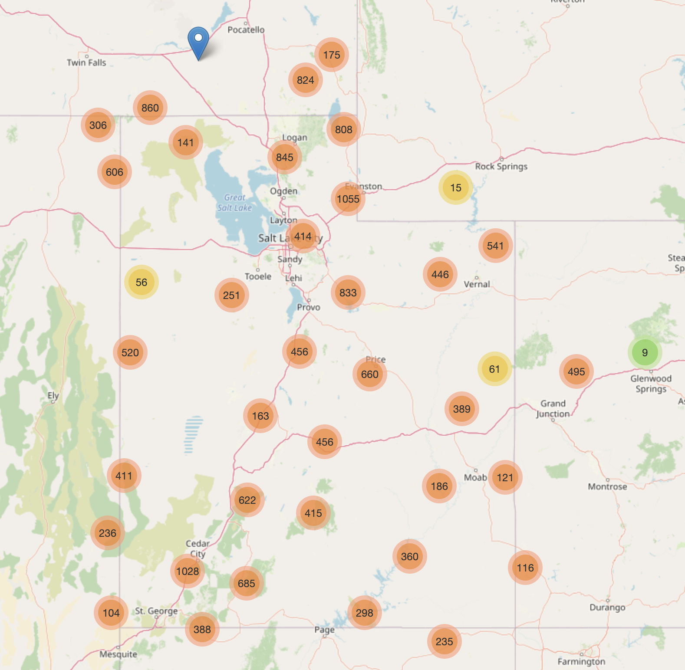
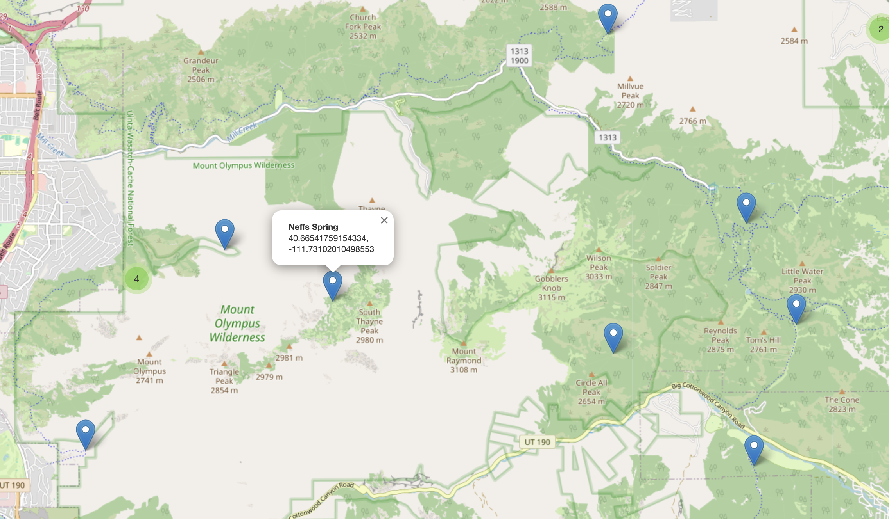

# ut-springs

https://cl0cks4fe.github.io/

HTML web page (`springs.html`) of gathered geo plots of springs across Utah (and surrounding area).

Springs with names have the name attached, like neffs:

Further works was being done in manual to convert a large list of plss spring data and plot it on a map also, but I have left Utah and will not pick this back up until I am back and spring hunting.
